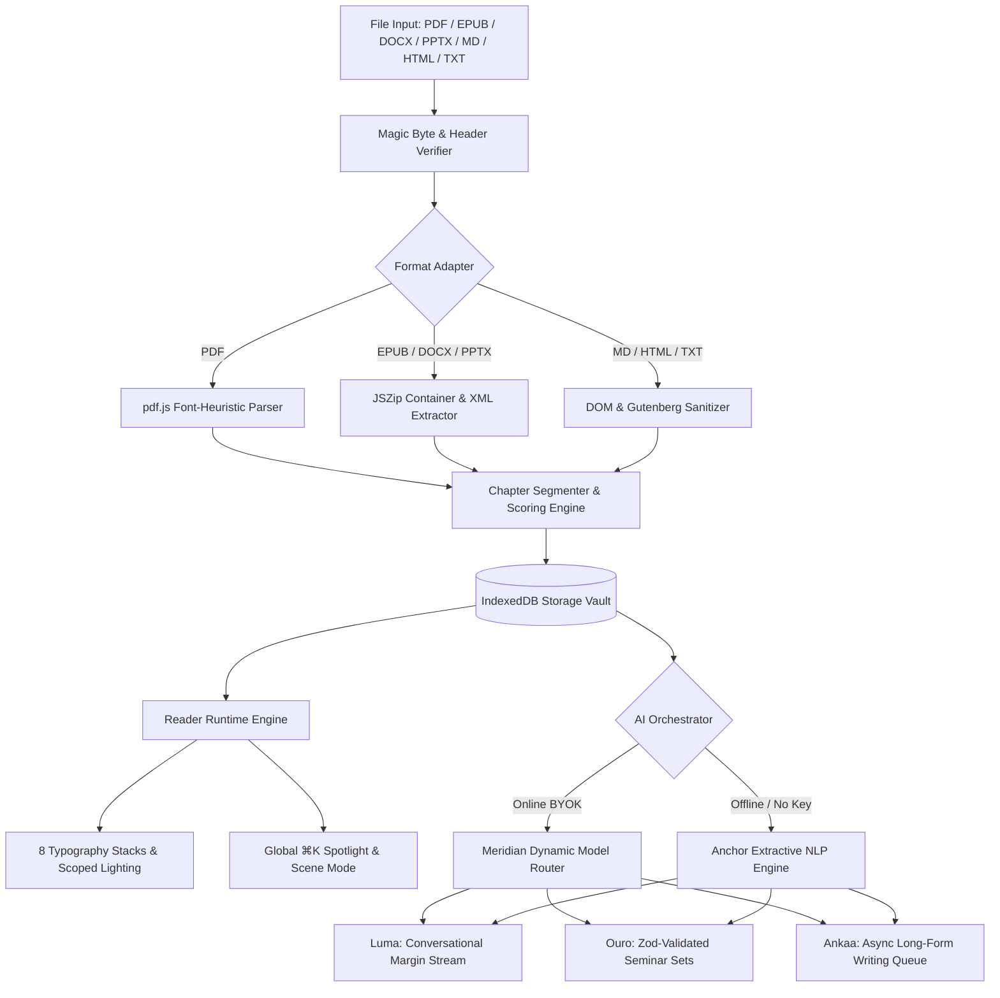

<div align="center">


### A local-first AI reading room where documents become living, interactive experiences.

[](https://www.typescriptlang.org/)
[](https://nextjs.org/)
[](https://tailwindcss.com/)
[](https://developer.mozilla.org/en-US/docs/Web/API/IndexedDB_API)
[](https://openrouter.ai/)
[](#license)

</div>

---

## ✦ Table of Contents

- [Overview](#-overview)
- [Core Architecture & Philosophy](#-core-architecture--philosophy)
- [System Pipeline](#-system-pipeline)
- [The Three Companions](#-the-three-companions)
- [Cinematic Reader & Typography](#-cinematic-reader--typography)
- [Document Ingestion & Magic Bytes](#-document-ingestion--magic-bytes)
- [Zero-Proxy AI & Security Model](#-zero-proxy-ai--security-model)
- [Design System ("Vellum & Ember")](#-design-system-vellum--ember)
- [Keyboard Shortcuts](#-keyboard-shortcuts)
- [Quick Start](#-quick-start)
- [Scripts & Tooling](#-scripts--tooling)
- [Deployment](#-deployment)
- [License](#-license)

---

## ✦ Overview

**Lemniscate** transforms static books, papers, slides, and stories into chapter-aware, interactive reading rooms. Built from first principles as a **local-first** engine, your library, reading positions, highlights, and study sets live strictly within your browser's IndexedDB storage.

When connected to an API key, three dedicated AI companions operate directly in the margins — answering questions, crafting seminar-grade study sets, and generating long-form writing desks. When offline or without an API key, the built-in **Anchor** engine executes extractive NLP entirely on-device, ensuring uninterrupted reading flow.

---

## ✦ Core Architecture & Philosophy

```
  ┌─────────────────────────────────────────────────────────────┐
  │                    LOCAL-FIRST BROWSER RUNTIME              │
  ├───────────────┬───────────────────────────────┬─────────────┤
  │ Ingestion     │ Client-Side Parsers (pdf.js,  │ Magic Byte  │
  │ Engine        │ JSZip for EPUB/DOCX/PPTX)     │ Validation  │
  ├───────────────┼───────────────────────────────┼─────────────┤
  │ Persistence   │ IndexedDB (lemniscate-db)     │ Zero Cloud  │
  │ Vault         │ Anonymous Identity Partition  │ Databases   │
  ├───────────────┼───────────────────────────────┼─────────────┤
  │ Orchestration │ Meridian (Free Model Router)  │ Anchor (100%│
  │ Layer         │ Direct Browser → OpenRouter   │ Offline NLP)│
  ├───────────────┼───────────────────────────────┼─────────────┤
  │ Reader        │ 8 Editorial Font Stacks       │ Scene View, │
  │ Runtime       │ 3 Lighting Scopes, Bookmarks  │ Virtualized │
  └───────────────┴───────────────────────────────┴─────────────┘
```

1. **Local-First & Sovereign**: Everything runs on the client device. Documents never leave the browser unless an explicit AI request is dispatched by the user.
2. **Zero-Proxy BYOK**: No backend server proxies or middleman servers. The browser communicates directly with `https://openrouter.ai` using a session-scoped in-memory API key.
3. **Graceful Offline Degradation**: If network drops or no key is provided, the **Anchor** engine seamlessly fulfills companion interactions via extractive algorithms.
4. **Clean Layered Separation**:
   $$\text{Input} \longrightarrow \text{Ingestion Pipeline} \longrightarrow \text{Structured Data} \longrightarrow \text{Runtime Engine} \longrightarrow \text{UI}$$

---

## ✦ System Pipeline



---

## ✦ The Three Companions

Lemniscate introduces three specialized companions operating alongside your reading flow:

| Companion | Archetype | Capabilities | Offline Mode (Anchor) |
|:---|:---|:---|:---|
| **Luma** | *Marginalia Conversationalist* | Token-by-token SSE streaming, contextual chapter citations, quote extraction, conversational depth, markdown-lite rendering. | Extractive text search with heuristic sentence scoring and quotation ranking. |
| **Ouro** | *Seminar & Study Architect* | Generates comprehensive study sets: Executive summaries, thematic breakdowns, character rosters, vocabulary, sourced quizzes, flashcards, and essay prompts. Validated with strict **Zod schemas** and cached 7 days per document hash. | Deterministic extraction of key vocabulary, structural summaries, and passage-level flashcards. |
| **Ankaa** | *Writing & Synthesis Desk* | Drafts long-form essays, critiques, and creative extensions (~2,500 words online / ~1,800 words offline). Managed via an **asynchronous background job queue** with live word counts, step trackers, and crash recovery. | Multi-pass heuristic expansion synthesizing chapter segments into structured drafts. |

---

## ✦ Cinematic Reader & Typography

The reader interface is designed to disappear, leaving only the narrative.

### Typography Stacks
Research-backed typography engineered specifically for sustained long-form reading:
- **Literata**: Modern digital book face designed for Google Play Books.
- **EB Garamond**: Classic Renaissance elegance with true book proportions.
- **Spectral**: Crisp, contemporary editorial serif created for screen legibility.
- **Source Serif 4**: Adobe's open-source editorial workhorse.
- **Georgia**: High-contrast, robust system serif.
- **Bookerly**: Amazon Kindle's purpose-built reading face.
- **Baskerville**: High-contrast transitional serif with classical weight.
- **Palatino**: Hermann Zapf's humanist Renaissance masterpiece.

### Lighting & Contrast Scopes
- **Obsidian Dark**: Warm near-black backgrounds (`#08070a` to `#15131b`) with amber undertones.
- **Vellum Light**: Soft, low-glare parchment surface (`#f7f4ed`) tailored for daylight.
- **Parchment Sepia**: Warm nostalgic paper tone (`#f0e3c9`) with earthen contrast.
- **High-Contrast Toggle**: Intensifies text contrast across all three lighting scopes.

### Reading Controls
- **Cinematic Scene Mode (`s`)**: Isolates dialogue and action into focused theatrical beats.
- **In-Document Search (`/`)**: Instant client-side fuzzy search across all chapters.
- **Text Controls**: Granular adjustments for font size, line height, paragraph spacing, measure width, and decorative drop-caps.
- **Bookmarks & Annotations (`b`)**: Multi-colored highlights, margin notes, and instant review trays.

---

## ✦ Document Ingestion & Magic Bytes

To ensure safety and reliability, Lemniscate validates all uploaded files using **magic bytes** rather than trusting client-reported MIME types:

| Format | Magic Bytes / Header | Ingestion Adapter | Output Structure |
|:---|:---|:---|:---|
| **PDF** | `%PDF-` (`0x25 0x50 0x44 0x46 0x2D`) | `pdfjs-dist` (Worker-isolated) | Font-size heuristic chapters & structural sections |
| **EPUB** | `PK\x03\x04` (`mimetype: application/epub+zip`) | `JSZip` Container & OPF Spine Walk | Ordered spine items transformed into native chapters |
| **DOCX** | `PK\x03\x04` (`word/document.xml`) | `JSZip` XML Parser | Heading-style mapped chapters and paragraph preservation |
| **PPTX** | `PK\x03\x04` (`ppt/presentation.xml`) | `JSZip` XML Slide Extractor | Individual slides formatted as discrete readable chapters |
| **Markdown** | Text UTF-8 Validation | Native Regex Parser | ATX (`#`) and Setext (`===`) heading hierarchies |
| **HTML** | `<!DOCTYPE html` or `<html>` | DOMParser + Readability Sanitizer | Stripped boilerplate, extracted main prose chapters |
| **Plain Text** | UTF-8 / ASCII Byte Validation | Boilerplate Stripper | Project Gutenberg header/footer sanitization, chapter splits |

---

## ✦ Zero-Proxy AI & Security Model

```
  ┌─────────────────┐        Direct HTTPS (Bearer Key)        ┌─────────────────┐
  │  User Browser   │ ──────────────────────────────────────> │  OpenRouter AI  │
  │  (Lemniscate)   │ <────────────────────────────────────── │  (Catalog/LLM)  │
  └─────────────────┘             SSE Stream Tokens           └─────────────────┘
           │
           │ Key in Memory Only (Evaporates on Tab Close)
           ▼
  ┌─────────────────┐
  │  No Proxy API   │
  │  No Telemetry   │
  │  No Remote DB   │
  └─────────────────┘
```

- **Session-Scoped Memory Keys**: API keys are stored in runtime JavaScript memory only. They are never written to `localStorage`, `IndexedDB`, or server logs. Closing the browser tab destroys the key instantly.
- **Zero Middleman Proxy**: There are no intermediary `/api/ai` endpoints. Requests flow directly between your browser and OpenRouter over TLS.
- **Delimiter-Fenced Prompts**: Document excerpts are wrapped in strict `<<<document_content>>>` boundary fences with system-prompt grounding to prevent prompt-injection attacks.
- **Anonymous Identity**: All local IndexedDB records are stamped with an on-device anonymous session UUID.

---

## ✦ Design System ("Vellum & Ember")

Lemniscate is styled using Tailwind CSS v4's `@theme` directive, utilizing warm obsidian darks and amber accents:

```css
/* Palette Tokens */
--color-ink-950: #08070a;      /* Obsidian canvas */
--color-ink-900: #0d0c10;      /* Elevated dark surface */
--color-mist-100: #f5f1ea;     /* Primary parchment text */
--color-gold-500: #d9ad52;     /* Core amber accent */

/* Companion Accent Tokens */
--color-ouro-500: #6d84e8;     /* Study indigo */
--color-ankaa-500: #db814c;    /* Writing ember */
--color-ok-500: #67ba7c;       /* Reading moss */
```

Dynamic accent switching (`data-accent="ouro | ankaa | ok"`) dynamically recalculates the entire application's focus rings, badges, progress bars, and glows through centralized CSS custom properties.

---

## ✦ Keyboard Shortcuts

| Shortcut | Scope | Action |
|:---|:---|:---|
| <kbd>⌘</kbd> + <kbd>K</kbd> / <kbd>Ctrl</kbd> + <kbd>K</kbd> | Global | Open Universal Spotlight Search |
| <kbd>Alt</kbd> + <kbd>→</kbd> | Reader | Advance to Next Chapter |
| <kbd>Alt</kbd> + <kbd>←</kbd> | Reader | Return to Previous Chapter |
| <kbd>/</kbd> | Reader | Open In-Document Search |
| <kbd>L</kbd> | Reader | Toggle Luma & Ouro Margin Drawer |
| <kbd>T</kbd> | Reader | Toggle Table of Contents Drawer |
| <kbd>B</kbd> | Reader | Add Bookmark / View Annotations |
| <kbd>S</kbd> | Reader | Toggle Cinematic Scene Mode |
| <kbd>Esc</kbd> | Overlays | Dismiss Modal / Close Active Drawer |

---

## ✦ Quick Start

### Prerequisites
- **Runtime**: [Bun](https://bun.sh) `>= 1.1` (or Node.js `>= 20`)
- **Package Manager**: Bun (recommended) or npm/pnpm/yarn

### 1. Clone & Install
```bash
git clone https://github.com/Pushyanth02/Lemniscate.git
cd Lemniscate
bun install
```

### 2. Launch Local Dev Server
```bash
bun run dev
```
Open **[http://localhost:3000](http://localhost:3000)**. Two classic texts are seeded into your local library immediately on first launch.

---

## ✦ Scripts & Tooling

```bash
# Start local development server on port 3000
bun run dev

# Run TypeScript strict type-checking
bun run typecheck

# Run ESLint validation (0 errors, 0 warnings)
bun run lint

# Compile production static export to out/
bun run build

# Clean build artifacts and caches
bun run clean

# Run complete CI verification suite (lint + typecheck + build)
bun run ci
```

---

## ✦ Deployment

### Vercel (Recommended)
Lemniscate is configured for static export deployment on [Vercel](https://vercel.com).
```bash
bunx vercel --prod
```
Since Lemniscate is client-rendered with IndexedDB storage, no backend server environment variables or serverless functions are required.

### Any Static Host
Build the static distribution:
```bash
bun run build
```
Deploy the generated `out/` directory to GitHub Pages, Cloudflare Pages, Netlify, or serve locally:
```bash
bunx serve out
```

---

## ✦ License

Private & proprietary. All rights reserved.
